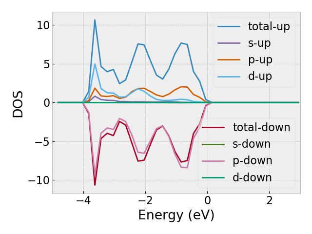
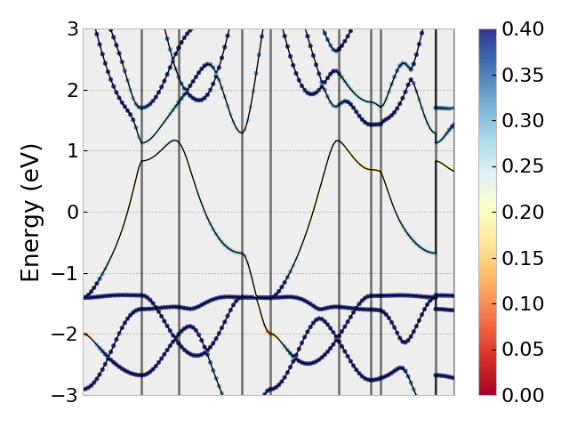

Using vasprun from the command line
===================================
After installation, the executable called ``vasprun`` will be automatically included to the path. This executable provides several convenient shortcut to various functions.

Overview
--------
``$ vasprun -h``

Options:
  -h, --help            show this help message and exit
  -i, --incar           export incar file
  -p poscar_file, --poscar=poscar_file 
                        export poscar file
  -k, --kpoints         kpoints file
  -d dos_plot, --dosplot=dos_plot
                        export dos plot, options: t, spd, a, a-Si, a-1
  -b band_plot, --bandplot=band_plot
                        export band plot, options: normal or projected
  -v vasprun, --vasprun=vasprun
                        path of vasprun.xml file, default: vasprun.xml
  -f, --showforce       show forces, default: no
  -a, --allparameters   show all parameters
  -e, --eigenvalues     show eigenvalues in valence/conduction band
  -s smearing, --smear=smearing
                        smearing parameter for dos plot, e.g., 0.1 A
  -n figname, --figname=figname
                        dos/band figure name, default: fig.png
  -l lim, --lim=lim     dos/band plot lim, default: -3, 3
  -m max, --max=max     band plot colorbar, default: 0.5

1, A quick look up
-------------------
`vasprun` must start with a `vasprun.xml` file followed by `-v` command. 
If you just load a file, it will attempt to parse the file and give you a summary of the calculation as follows.

``$ vasprun -v vasprun.xml``

::

  formula :   Sc4C4
  efermi :   5.71888444
  energy :   -65.82108919
  metal :   True
  gap :   -0.4621
  +----+--------------+----------+-----------+
  |    | functional   | labels   |   valence |
  |----+--------------+----------+-----------|
  |  0 | PBE          | Sc_sv    |        11 |
  |  1 | PBE          | C        |         4 |
  +----+--------------+----------+-----------+
  +----+----------------------+-------------------------+
  |    | lattice              | stress                  |
  |----+----------------------+-------------------------|
  |  0 | [3.478641, 0.0, 0.0] | [-4.62998221, 0.0, 0.0] |
  |  1 | [0.0, 4.682565, 0.0] | [0.0, 1.73781963, 0.0]  |
  |  2 | [0.0, 0.0, 6.176701] | [0.0, 0.0, 5.81088683]  |
  +----+----------------------+-------------------------+

Optionally, you can have a quick look at the other items such as 

- force (``-f yes``)
- incar (``-i``)
- kpoints (``-k``)
- eigenvalues by band (``-e``)

Below is an example output of forces

``$ vasprun -v vasprun.xml -f yes``

::

  +----+--------------------------+---------------------------------+
  |    | atom                     | force                           |
  |----+--------------------------+---------------------------------|
  |  0 | [0.0, 0.5, 0.606519]     | [0.0, 0.0, 0.02408274]          |
  |  1 | [0.0, 0.0, 0.958081]     | [0.0, 0.0, 0.07723516]          |
  |  2 | [0.5, 0.5, 0.041919]     | [0.0, 0.0, -0.07723516]         |
  |  3 | [0.5, 0.0, 0.393481]     | [0.0, 0.0, -0.02408274]         |
  |  4 | [0.5, 0.83775, 0.744469] | [0.0, 0.0691885, -0.00447732]   |
  |  5 | [0.5, 0.16225, 0.744469] | [-0.0, -0.0691885, -0.00447732] |
  |  6 | [0.0, 0.33775, 0.255531] | [0.0, 0.0691885, 0.00447732]    |
  |  7 | [0.0, 0.66225, 0.255531] | [0.0, -0.0691885, 0.00447732]   |
  +----+--------------------------+---------------------------------+

``$ vasprun -v vasprun.xml -i``

::

    PREC = accurate
    ALGO =  Normal
    ISPIN = 1
    ICHARG = 11
    NELM = 60
    IBRION = -1
    EDIFF = 0.0008
    NSW = 0
    ISIF = 3
    ISYM = 0
    ENCUT = 520.0
    NBANDS = 96
    LREAL =  Auto
    ISMEAR = 1
    SIGMA = 0.001
    LWAVE = True
    LCHARG = False
    LVHAR = False
    LORBIT = 11
    LELF = True
    LAECHG = False

``$ vasprun -v vasprun.xml -e``

::

                           K-points    band29    band30
    0   [0.0625, 0.08333333, 0.125]  0.280116  0.805916
    1   [0.1875, 0.08333333, 0.125] -0.129884  0.397816
    2   [0.3125, 0.08333333, 0.125] -0.500984  0.053016
    3   [0.4375, 0.08333333, 0.125] -0.824384 -0.154884
    4         [0.0625, 0.25, 0.125] -0.039884  0.636616
    5         [0.1875, 0.25, 0.125] -0.455184  0.752516
    6         [0.3125, 0.25, 0.125] -0.968484  0.633316
    7         [0.4375, 0.25, 0.125] -1.209584  0.479716
    8   [0.0625, 0.41666667, 0.125]  0.033916  0.729716
    9   [0.1875, 0.41666667, 0.125] -0.666684  1.317716
    10  [0.3125, 0.41666667, 0.125] -1.092484  1.112816
    11  [0.4375, 0.41666667, 0.125] -1.314384  1.003616
    12  [0.0625, 0.08333333, 0.375]  0.064116  0.291916
    13  [0.1875, 0.08333333, 0.375] -0.061484  0.089116
    14  [0.3125, 0.08333333, 0.375] -0.503184 -0.094584
    15  [0.4375, 0.08333333, 0.375] -0.787284 -0.181984
    16        [0.0625, 0.25, 0.375]  0.156316  0.468016
    17        [0.1875, 0.25, 0.375] -0.367884  0.509416
    18        [0.3125, 0.25, 0.375] -0.545584  0.255816
    19        [0.4375, 0.25, 0.375] -0.846084  0.169116
    20  [0.0625, 0.41666667, 0.375]  0.061516  0.902016
    21  [0.1875, 0.41666667, 0.375] -0.499984  1.060316
    22  [0.3125, 0.41666667, 0.375] -0.736784  0.704616
    23  [0.4375, 0.41666667, 0.375] -0.883584  0.560916
    Eigenvalue at CBM:  -0.1820
    Eigenvalue at VBM:   0.2801
    minimum gap at :  [0.1875, 0.08333333, 0.375]
    CB:                  0.0891
    VB:                 -0.0615
    diff:                0.1506

2, Plot DOS
------------
A number of ways of plotting dos are also supported, some basic options are related to the plot

- ``-d`` the desired DOS to be plotted (``t``: total dos; ``spd``: spd dos)
- ``-l`` the range of x-axis, by default it is (-3, 3) relative to the Fermi level)
- ``-s`` the smearing width  (by default it is 0.1 A)
- ``-n`` figure name

If ``spin`` is included in vasprun.xml, the plot will show both up and down spin states separately.

``$ vasprun -v vasprun.xml -d t+spd -s 0.15 -n dos-spd.png``

.. image:: ../images/dos.png
   :height: 600 px
   :width: 903 px
   :scale: 40 %

3, Plot Band structure
----------------------

- ``-b`` type of band structure to show (``normal``: normal plot; ``projected``: colored by projection)
- ``-l`` the range of x-axis, by default it is (-3, 3) relative to the Fermi level)
- ``-m`` band plot colorbar for the projected mode, default: 0.5
- ``-n`` figure name

``$ vasprun -v vasprun.xml-band -b normal -l -3,3 -m 0.4 -n band.png``

.. image:: ../images/band.png
   :height: 600 px
   :width: 903 px
   :scale: 40 %

4, IR intensity analysis
------------------------

Suppose the calculation ased to calculate the dynamical matrix with some keywords specified in the ``incar`` 

::

    IBRION = 8
    LPEAD = True
    LEPSILON = True
    LMAXTAU = 0

``vasprun`` can also analyze each eigen mode and compute the IR intensity.

``$ vasprun -v vasprun-2.xml --dyn``

::

   Freq(cm-1)    IR Intensity     E_xx         E_yy         E_zz
     766.177        0.000        0.000        0.000        0.000
     499.368        0.000        0.000        0.000        0.000
     498.560        0.000        0.000        0.000        0.000
     471.772       26.581        0.000        0.567        1.432
     471.525       26.974        2.030        0.000        0.000
     469.436       26.662        0.000        1.449        0.573
     358.279        0.000        0.000        0.000        0.000
     357.640        0.000        0.000        0.000        0.000
     357.198        0.000        0.000        0.000        0.000
     291.977        0.291        0.000        0.000        0.022
     291.951        0.273        0.021        0.000        0.000
     291.753        0.000        0.000        0.000        0.000
     196.964        0.036        0.008        0.000        0.000
     195.731        0.096        0.000        0.025        0.000
     194.879        0.217        0.059        0.000        0.000
     183.073       87.765        0.000       10.144       13.365
     182.688       87.888        0.000       13.378       10.258
     182.000       86.936       23.395        0.000        0.000
     101.136       16.402        0.000        2.622       29.794
     100.029       17.000       33.783        0.000        0.000
      99.648       16.597        0.000       30.939        2.669
      98.087        0.000        0.000        0.000        0.000
      97.652        0.000        0.000        0.000        0.000
      97.350        0.000        0.000        0.000        0.000
      36.874        0.000        0.000        0.000        0.000
      32.907        0.000        0.000        0.000        0.000
      20.579        0.000        0.000        0.000        0.000
       0.326       21.804        0.000        0.000        0.000
       0.445       21.903        0.000        0.000        0.000
       1.467       21.685        0.000        0.000        0.000
    Total                       59.296       -0.000        0.000
    Total                       -0.000       59.123        0.168
    Total                        0.000        0.168       58.114
    -1.4492664013321388e-11
    DFPT                        59.464        0.000       -0.000
    DFPT                         0.000       59.394        0.239
    DFPT                        -0.000        0.239       58.647
