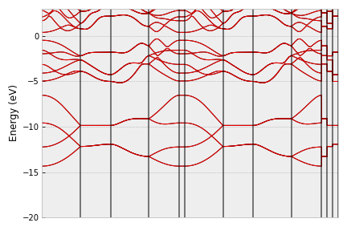
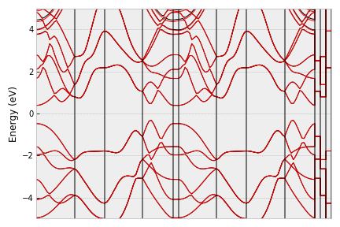
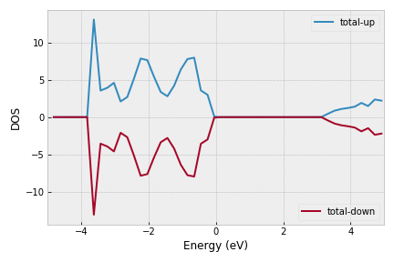

Using vasprun as a python library
=================================

``vasprun`` can be also used as a stand-alone library for high-throughput analysis on many calculations.

0, Load the file
------------------
To start, you can simply load the file.

.. code-block:: Python

    from vasprun import vasprun
    vasp = vasprun('vasprun.xml')

1, Parse the convergence
-------------------------

As long as the ``vasp`` object is created, it is advised to check the calculation is correctly done or not.

.. code-block:: Python

    >>> vasp = vasprun('error-vasprun.xml')
    >>> vasp.errormsg
    'SCF is not converged'
    >>> vasp.error
    True

2, Extract the useful info
---------------------------

Then, you can retrieve many informations from ``vasp.values`` attribute. The values have a variety of formats, e.g.

- ``incar`` (dict)
- ``kpoints`` (dict)
- ``metal`` (bool)
- ``gap`` (float)
- ...

.. code-block:: Python

    >>> vasp.values.keys()
    dict_keys(['incar', 'kpoints', 'parameters', 'name_array', 'composition', 'elements', 'formula', 'pseudo_potential', 'potcar_symbols', 'valence', 'mass', 'calculation', 'finalpos', 'bands', 'occupy', 'metal', 'gap', 'cbm', 'vbm'])
    >>> vasp.values['gap']
    0
    >>> vasp.values['metal']
    True
    >>> vasp.values['vbm']
    {'kpoint': array([0.0625    , 0.08333333, 0.125     ]), 'value': 0.2801155599999996}
    >>> vasp.values['cbm']
    {'kpoint': array([0.4375    , 0.08333333, 0.375     ]), 'value': -0.18198443999999991}
    >>> from pprint import pprint
    >>> pprint(vasp.values['incar'])
    {'ALGO': ' Normal',
     'EDIFF': 0.0004,
     'ENCUT': 520.0,
     'IBRION': -1,
     'ICHARG': 0,
     'ISIF': 3,
     'ISMEAR': 1,
     'ISPIN': 1,
     'LAECHG': False,
     'LCHARG': True,
     'LELF': True,
     'LORBIT': False,
     'LREAL': ' Auto',
     'LVHAR': False,
     'LWAVE': True,
     'NELM': 100,
     'NSW': 0,
     'PREC': 'accurate',
     'SIGMA': 0.05}

3, useful functions
---------------------

.. code-block:: Python

    vasp = vasprun('vasprun-band.xml')
    vasp.plot_band(filename='band1.png')

If you want to adjust the range of energy, just use the ``ylim`` parameter,

.. code-block:: Python

    vasp.plot_band(filename='band2.png', ylim=[-5,5])

.. code-block:: Python

    vasp.plot_dos(filename='dos1.png', ylim=[-5,5])

for more advanced usage, please refer to the :ref:`vasprun package`
